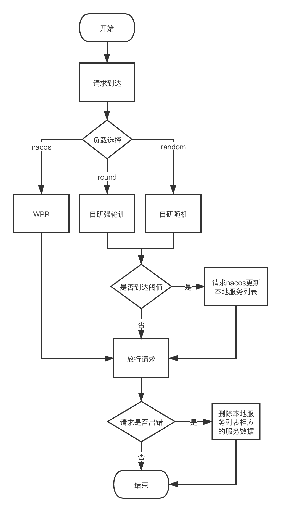
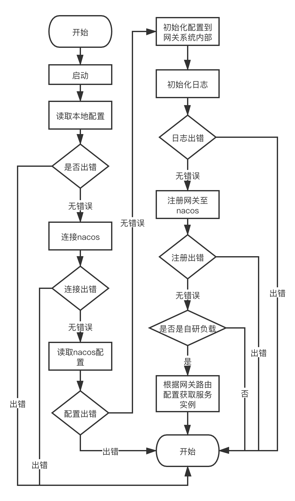
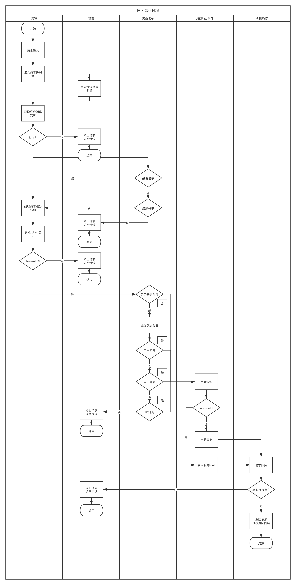

# go-gateway

### 自研网关

---

## 网关功能

### 基于本地的配置

```yaml
# 是否开启nacos配置中心
NacosConfiguration: true
# 是否开启nacos服务注册于发现
NacosDiscovery: true
# nacos地址
NacosServerIps: '127.0.0.1'
# nacos端口号
NacosServerPort: 8848
# nacos命名空间
NacosClientNamespaceId: 'f3e0c037-7fe1-452f-8f37-16b3810846b5'
# 请求Nacos服务端的超时时间（ms）
NacosClientTimeoutMs: 5000
# nacos配置文件名称
NacosDataId: 'go-gateway.yml'
# nacos配置组名称
NacosGroup: 'go-framework'
```

### 基于nacos的配置

```yaml
# 服务的配置
serve:
  # 端口号
  port: 27070
  # 服务名称
  server-name: 'go-gateway'
  # 服务权重
  weight: 10
# 日志配置
log:
  # 日志地址
  path: '/Users/zhangzhen/logs/golang'
  # 日志级别
  level: 'debug'
# 路由
routers:
  # 版本
  version: 'v1-0-0'
  # 请求次数刷新服务
  refresh-tmz: 10
  # 负载均衡方法
  load-balance: 'nacos'
  # 反向代理服务名
  services:
    'go-framework': 'go-framework'
    'go-framework-provider': 'go-framework'
# 黑白名单(ip-address)
bw-list:
  # 黑名单
  black-list:
    - '127.0.0.100'
    - '127.0.0.2'
  # 白名单
  white-list:
    - '127.0.0.1'
    - '127.0.0.2'
# 灰度发布
grayscale:
  # 是否开启
  open: true
  # 需要灰度版本
  version: 'v1-0-1'
  # 种类：'userScope':用户ID范围,'userList':用户列表,'ipList':IP列表
  type: 'ipList'
  # 配置列表
  list:
    - '127.0.0.1'
    - '127.0.0.2'
  # 范围
  scope:
    # 种类：'great':大于,'less':小于
    type: 'great'
    # 值
    mark: '100'

```
#### 注：
+ 日志级别可动态修改；
+ 路由中，`load-balance`目前可选择`① random:自研随机; ② round:自研强轮训; ③ nacos:基于nacos的WRR算法`，可动态调节；
+ 如果`load-balance`选择`① random:自研随机; ② round:自研强轮训`，则配置`refresh-tmz`会启用，这个配置为当同一个服务达到配置次数，会主动访问服务注册发现中心获取服务列表，并更新本地列表；
+ 当网关转发请求，并请求到下层服务时`connection refused`的时候，网关会主动删除当前服务，待到`refresh-tmz`时会主动重新校准服务列表；
+ 路由中，`version`配置为当前反向代理所有服务的版本号；
+ nacos的WRR算法：`① 从权重中选出最大的，减去总权重；② 然后再给每个权重加上自身权重初始值； ③ 再次轮训，直到权重为0，确定序列`；

| 请求编号 | 选前权重值 | 被选中server | 选后权重值 |
|:----:|:----:|:----:|:----:|
| 1    |5,1,1    |a|    -2,1,1|
|2    |3,2,2    |a    |-4,2,2|
|3    |1,3,3    |b    |1,-4,3|
|4    |6,-3,4    |a    |-1,-3,4|
|5    |4,-2,5    |c    |4,-2,-2|
|6    |9,-1,-1    |a    |2,-1,-1|
|7    |7,0,0    |a    |0,0,0|

+ nacos的WRR算法说明：`① 第一行最后的-2 , 1 , 1 是 5(当前权值最大) - 7（总权重）=-2 ,其他两个值不变得来的；② 第二行的 3，2， 2， 是 上一行的 -2 , 1 , 1 加 各自权重初始值 5 ,1 1 得来的。（3=-2+5 , 2 = 1+1 , 2 = 1+1）`；
+ 大致请求流程：
  

### 黑白名单
#### 配置
```yaml
# 黑白名单(ip-address)
bw-list:
  # 黑名单
  black-list:
    - '127.0.0.1'
    - '127.0.0.2'
  # 白名单
  white-list:
    - '127.0.0.1'
    - '127.0.0.2'
```
#### 注：
+ 配置可以为空；
+ 名单配置需要符合`yaml`的数组方式配置；
+ 白名单的优先级高于黑名单，即命中白名单，即便存在黑名单也会放行；
+ 可以动态添加或删除黑白名单；
+ 请求该网关时，nginx配置必须增加`X-Real_Ip`的配置。

### 灰度发布
```yaml
# 灰度发布
grayscale:
  # 是否开启
  open: true
  # 需要灰度版本
  version: 'v1-0-0'
  # 种类：'userScope':用户ID范围,'userList':用户列表,'ipList':IP列表
  type: 'ipList'
  # 配置列表
  list:
    - '127.0.0.1'
    - '127.0.0.2'
  # 范围
  scope:
    # 种类：'great':大于,'less':小于
    type: 'great'
    # 值
    mark: '100'
```
#### 注：
+ 可以动态调节是否开启灰度发布；
+ 一共有三种灰度方式：① userScope:用户ID范围；② userList:用户列表；③ ipList:IP列表；
+ 当开启灰度后，`version、type、list或者scope`必须有值；
+ 如果是`userScope`，那么`scope`配置起作用，设定`mark`值后，例如设置为100：`mark: 100`，如果是`type`为`great`：那么所有`userId`大于100的请求将走进`version`设定的版本服务中；反之：如果是`type`为`less`：那么所有`userId`小于100的请求将走进`version`设定的版本服务中；
+ 如果是`userList`，那么`list`配置起作用，所有命中`list`中的`user_id`将走进`version`设定的版本服务中；
+ 如果是`ipList`，那么`list`配置起作用，所有命中`list`中的`ip`将走进`version`设定的版本服务中；
+ 所有的参数都可以动态配置修改，热启用，毋需停止网关服务；
+ 当AB测试完毕，和灰度发布完毕，需要把全局的服务统一成同一个版本后，把网关的值调整为正确的配置，关闭灰度发布：`grayscale.open = false`，修改`routers.version`为最新的版本号；
+ 如果接口请求中不含有`access-token`，那么关于用户的灰度没有作用，例如登录接口；

## 更新access-token和强制下线
```yaml
# 用户携带token
access-token:
  # 校验字段
  verify: '8ja81zhjRSsr8Vkr'
  # 更新token的时间(天)
  refresh: 20
  # 过期token的时间(天)
  expire: 30
  # 强制下线(用户ID) 如果用户ID为-1，则为全局强制下线
  force-login-out:
    - -1
    - 1000
```
+ 请求中如果有access-token，会根据加解密获取token信息，带入至go-gin的框架中；
+ 会根据nacos中配置`verify`校验access-token的正确性；
+ 会根据`refresh`时间更新access-token；
+ 会根据`expire`过期access-token；
+ 如果access-token时间小于`refresh`，则正常解析请求；如果access-token时间大于`refresh`并且小于`expire`，则生成新的access-token供前端存储；如果access-token时间大于`expire`，则直接报错登录过期；
+ 刷新的access-token会存在与返回体的头中，例如：`access-token: eyJhbGciOiJIUzI1NiIsInR5cCI6IkpXVCJ9.0iOiIyMDIxLTAxLTE1IDE4OjM0OjA2IiwidXNyX2ZybSI6IndlY2hhdCIsInVzcl9pZCI6MX0eyJsZ25fdG.fb5VFl_ivVGqQYngP3xkw6JuUJaxTOITIjTrhG5TJRM`；
+ 基于jwt-token的强制下线，配置为`force-login-out`，数据结构为数组，配置参数为用户ID；
+ 强制下线，如果配置的用户ID为`-1`，意味着全局用户需要强制下线一次，重新登录；
+ 强制下线，如果配置的用户ID不为`-1`，意味着配置用户登录后，被强制下线一次，再重新登录；
+ 强制下线，当且仅当用户在配置之前登录且用户的`access-token`正确有效，会被强制下线一次，不涉及到登录接口无法调用。

---

## 网关启动流程


---

## 网关请求流程
